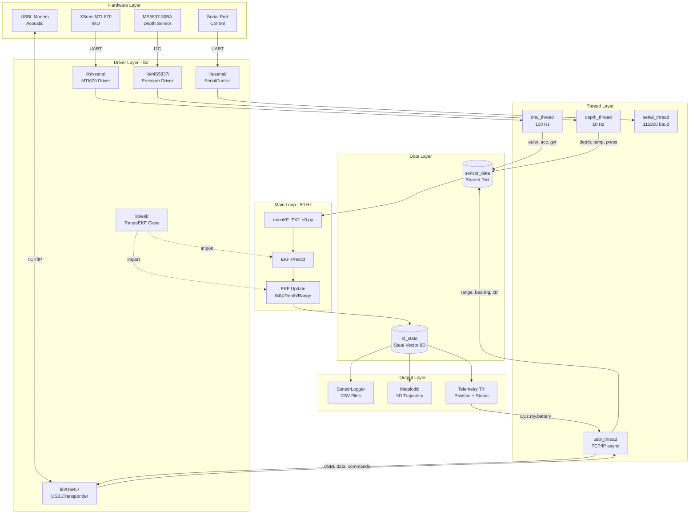

# Jetson High-Level Navigation &amp; Guidance

High-level navigation and guidance system for autonomous underwater vehicles based on **Nvidia Jetson TX2**, implementing an **Extended Kalman Filter (EKF)** for sensor fusion (IMU + Depth + USBL) and real-time state estimation.

<p align="center">
    <a href="https://www.labmacs.university/">
        
    </a>
</p>

---

## 2. Table of Contents

1. [Project Name](#1-project-name)
2. [Table of Contents](#2-table-of-contents)
3. [Project Description](#3-project-description)
    - 3.1 [Project Overview](#31-project-overview)
    - 3.2 [Schematics and Diagrams](#32-schematics-and-diagrams)
4. [Hardware and Software Requirements](#4-hardware-and-software-requirements)
    - 4.1 [Hardware Requirements](#41-hardware-requirements)
    - 4.2 [Software Requirements](#42-software-requirements)
5. [Pre-Run Configuration](#5-pre-run-configuration)
    - 5.1 [Installation](#51-installation)
    - 5.2 [Parameter Configuration](#52-parameter-configuration)
    - 5.3 [IMU Calibration](#53-imu-calibration)
    - 5.4 [Starting the Software](#54-starting-the-software)
6. [Execution Examples](#6-execution-examples)
    - 6.1 [Practical Use Case](#61-practical-use-case)
    - 6.2 [Expected Output](#62-expected-output)
7. [Gantt](#7-gantt)
8. [TC/TP](#8-tctp)
9. [KPI](#9-kpi)

---

## 3. Project Description

### 3.1 Project Overview

The system implements a **state estimation** pipeline for an underwater vehicle (AUV/ROV). The goal is to estimate in real-time:

- **Position** (X, Y, Z) in the local reference frame
- **Velocity** (Vx, Vy, Vz)
- **Attitude** (Roll, Pitch, Yaw)

Sensor fusion is performed using a **9-state Extended Kalman Filter (EKF)** that integrates:

| Sensor | Measurement | Frequency | Interface |
|--------|-------------|-----------|-----------|
| **XSens MTI-670** | Acceleration, Angular velocity, Orientation | 100 Hz | UART/USB |
| **BlueRobotics MS5837-30BA** | Depth (pressure) | 10 Hz | I2C |
| **USBL Transceiver** | Acoustic range, Bearing, Elevation | 0.5 Hz | TCP/IP |

The software supports:

- Bidirectional communication with control station via USBL
- Complete sensor data logging in CSV format
- Real-time 3D visualization (optional)
- Control command reception via serial port

#### USBL Communication Protocol

The system uses a bidirectional **REQUEST-RESPONSE** protocol via USBL acoustic modem:

**Transponder (Vehicle) → Transceiver (Surface)**

The vehicle periodically sends (every ~2 seconds) a telemetry packet containing:

| Field | Type | Unit | Description |
|-------|------|------|-------------|
| `timestamp` | float | s | Relative time since startup |
| `x`, `y`, `z` | float | m | EKF estimated position |
| `roll`, `pitch`, `yaw` | float | deg | Vehicle orientation |
| `battery_pct` | float | % | Battery level |
| `voltage` | float | V | Battery voltage |
| `temperature` | float | °C | Depth sensor temperature |
| `pressure` | float | mbar | Ambient pressure |

**Transceiver (Surface) → Transponder (Vehicle)**

The control station responds with USBL positioning data and commands:

| Field | Type | Unit | Description |
|-------|------|------|-------------|
| `mode` | enum | - | `ANGLES` (bearing/elevation) or `LONG` (ENU coordinates) |
| `east`, `north`, `up` | float | m | ENU coordinates (if mode=LONG) |
| `bearing_rad` | float | rad | Azimuthal angle (if mode=ANGLES) |
| `elevation_rad` | float | rad | Elevation angle (if mode=ANGLES) |
| `range_3d` | float | m | Calculated 3D distance |
| `integrity` | int | 0-100 | Acoustic signal quality |
| `enable` | bool | - | Enable/disable control |
| `bias_angle_deg` | float | deg | Angular compensation offset |
| `frequency_hz` | float | Hz | Requested update frequency |
| `use_range_only` | bool | - | Use range only (ignore angles) |

> **Note**: Messages are encoded in compressed binary format (struct + base64) to comply with the 64-byte acoustic protocol limit.

### 3.2 Schematics and Diagrams

#### Software Architecture

The application is structured as a **multi-threaded** system to handle asynchronous sensor acquisition and real-time processing.



#### Folder Structure

```
2025_Jetson_HL_Nav-Guidance-main/
├── src/                              # Main source code
│   ├── mainKF_TX2_v0.py              # ENTRY POINT - Main script
│   ├── imu_bias_calibration.json     # IMU bias calibration file
│   ├── lib/                          # Libraries and hardware drivers
│   │   ├── ekf/                      # Extended Kalman Filter library
│   │   │   ├── __init__.py
│   │   │   └── range_ekf.py          # RangeEKF class and Rxyz function
│   │   ├── xsens/                    # XSens MTI-670 IMU driver
│   │   ├── MS5837/                   # Depth sensor driver
│   │   ├── USBL/                     # USBL communication module
│   │   └── serial/                   # Serial control
│   ├── utils/                        # Utility scripts
│   │   ├── imu_calibration.py        # Static IMU calibration
│   │   ├── ekf_sensor_fusion.py      # Offline sensor fusion
│   │   └── sensor_diagnostics.py     # Sensor diagnostics
│   └── tests/                        # Unit tests
├── documents/                        # Documentation (manuals, datasheets)
├── media/                            # Images and schematics
├── old/                              # Previous software versions
├── sensor_logs/                      # Runtime CSV logs (generated)
├── requirements.txt                  # Python dependencies
└── README.md                         # This file
```

---

## 4. Hardware and Software Requirements

### 4.1 Hardware Requirements

| Component | Model | Notes |
|-----------|-------|-------|
| **Single Board Computer** | Nvidia Jetson TX2 | Or compatible Linux ARM/x86 SBC |
| **IMU** | XSens MTI-670 | UART/USB connection |
| **Depth Sensor** | BlueRobotics MS5837-30BA | I2C connection (bus 1) |
| **USBL System** | Compatible transceiver | Ethernet connection |
| **Serial Interface** | Secondary UART | For external commands (optional) |

### 4.2 Software Requirements

| Software | Version | Download Link |
|----------|---------|---------------|
| **Operating System** | Ubuntu 18.04/20.04 (JetPack) | [NVIDIA JetPack](https://developer.nvidia.com/embedded/jetpack) |
| **Python** | 3.6+ | [python.org](https://www.python.org/downloads/) |
| **numpy** | 1.13.3+ | [PyPI](https://pypi.org/project/numpy/) |
| **pyserial** | 3.5+ | [PyPI](https://pypi.org/project/pyserial/) |
| **smbus2** | 0.5.0+ | [PyPI](https://pypi.org/project/smbus2/) |
| **matplotlib** | 2.1.1+ | [PyPI](https://pypi.org/project/matplotlib/) |
| **scipy** | 0.19.1+ | [PyPI](https://pypi.org/project/scipy/) |

> **Note**: For detailed installation instructions and troubleshooting, refer to the **User Manual** in the `documents/` folder.

---

## 5. Pre-Run Configuration

### 5.1 Installation

1. **Clone the repository**:

    ```bash
    git clone <repository_url>
    cd 2025_Jetson_HL_Nav-Guidance-main
    ```

2. **Create virtual environment** (recommended):

    ```bash
    python3 -m venv .venv
    source .venv/bin/activate
    ```

3. **Install dependencies**:

    ```bash
    pip3 install -r requirements.txt
    ```

4. **Verify I2C access** (for depth sensor):

    ```bash
    sudo apt install i2c-tools
    sudo i2cdetect -y 1
    ```

    The MS5837 sensor should appear at address `0x76`.

5. **Verify serial ports**:

    ```bash
    ls -la /dev/ttyUSB*   # For XSens IMU
    ls -la /dev/ttyS*     # For control serial
    ```

### 5.2 Parameter Configuration

Configuration parameters are located at the top of file `src/mainKF_TX2_v0.py`:

```python
# =============================================================================
#  CONFIGURATION
# =============================================================================
CONTROL_LOOP_HZ = 50.0          # EKF loop frequency

IMU_PORT = "/dev/ttyUSB0"       # IMU serial port
DEPTH_I2C_BUS = 1               # Depth sensor I2C bus

ENABLE_GUI = False              # True for 3D visualization
ENABLE_LOGGING = True           # True for CSV logging

# USBL Transponder Configuration
USBL_IP = "192.168.0.232"       # USBL transceiver IP
USBL_PORT = 9200                # TCP port

TRANSPONDER_ID = 3              # Vehicle transponder ID
TRANSCEIVER_ID = 2              # Surface transceiver ID

# Serial Control Configuration
SERIAL_ENABLED = True
SERIAL_PORT = "/dev/ttyS0"
SERIAL_BAUDRATE = 115200
```

**Parameters to verify before execution:**

| Parameter | Description | Default Value |
|-----------|-------------|---------------|
| `IMU_PORT` | XSens IMU serial port | `/dev/ttyUSB0` |
| `DEPTH_I2C_BUS` | Depth sensor I2C bus | `1` |
| `USBL_IP` | USBL transceiver IP address | `192.168.0.232` |
| `USBL_PORT` | USBL transceiver TCP port | `9200` |
| `ENABLE_GUI` | Enable 3D visualization (requires display) | `False` |
| `ENABLE_LOGGING` | Enable CSV log saving | `True` |

### 5.3 IMU Calibration

IMU bias calibration is **highly recommended** before each mission to compensate for systematic errors in the accelerometer and gyroscope.

**Procedure:**

1. **Acquire static data**: Start the system with the vehicle **completely stationary** for ~60 seconds.

    ```bash
    python3 src/mainKF_TX2_v0.py
    # Wait 60 seconds, then interrupt with Ctrl+C
    ```

2. **Run the calibration script**:

    ```bash
    python3 src/utils/imu_calibration.py sensor_logs/imu_YYYYMMDD_HHMMSS.csv
    ```

    Replace the filename with the one generated in step 1.

3. **Output**: The script generates `imu_bias_calibration.json`:

    ```json
    {
        "bias_acc": [0.012, -0.008, 0.15],
        "bias_gyr": [0.001, -0.002, 0.0005],
        "var_acc": [0.001, 0.001, 0.002],
        "var_gyr": [0.0001, 0.0001, 0.0001]
    }
    ```

4. The file is **automatically loaded** on the next startup of `mainKF_TX2_v0.py`.

### 5.4 Starting the Software

```bash
python3 src/mainKF_TX2_v0.py
```

---

## 6. Execution Examples

### 6.1 Practical Use Case

**Scenario**: System test in pool with active USBL.

1. **Preparation**:
    - Position the USBL transceiver on the water surface
    - Verify network connection between Jetson and transceiver
    - Ensure IMU and depth sensor are connected

2. **Startup**:

    ```bash
    cd 2025_Jetson_HL_Nav-Guidance-main
    source .venv/bin/activate
    python3 src/mainKF_TX2_v0.py
    ```

3. **Operation**:
    - The system continuously acquires IMU and depth data
    - Every ~2 seconds it receives a USBL fix
    - Telemetry is sent to the transceiver
    - Logs are saved to `sensor_logs/`

### 6.2 Expected Output

#### System Startup

```text
======================================================================
EKF: IMU + Depth + USBL Transponder
======================================================================
USBL: 192.168.0.232:9200 (Transponder 3 -> Transceiver 2)
Serial: /dev/ttyS0 @ 115200 baud (Enabled: True)
Loop: 50.0 Hz
GUI: DISABLED
Logging: ENABLED
======================================================================

[CALIB] Loaded: imu_bias_calibration.json
[LOG] Logging enabled
[IMU] XSens initialized
[DEPTH] MS5837 initialized
[SERIAL] Serial thread started on /dev/ttyS0 @ 115200 baud
[USBL] Transponder 3 -> Transceiver 2
[USBL] Connecting to 192.168.0.232:9200

Waiting for messages...
```

#### USBL Data Reception (during operation)

```text
======================================================================
[MSG #12] TRANSCEIVER -> TRANSPONDER
======================================================================
  USBL Data (mode=ANGLES):
    Angles:   bearing=45.20deg  elev=-15.50deg
    Calc ENU: E=3.500  N=3.500  U=-1.500 m
    Range 3D: 5.230 m
    Quality:  integrity=98  RSSI=-85 dBm
  Control Data:
    enable=True  bias=0.00deg  freq=0.50Hz  use_range_only=False
----------------------------------------------------------------------

[EKF] Range update: meas=5.230m  pred=5.210m  innov=0.020m
```

#### Telemetry Transmission

```text
======================================================================
[MSG #13] TRANSPONDER -> TRANSCEIVER
======================================================================
  Telemetry:
    Position: x=3.510  y=3.490  z=-1.520 m
    Orient:   roll=0.12  pitch=-0.08  yaw=45.10 deg
    Battery:  85.0% @ 16.20V
    Sensors:  temp=22.5C  press=1120.0mbar
----------------------------------------------------------------------
```

#### Generated Log Files

After execution, you will find the following in the `sensor_logs/` folder:

```
sensor_logs/
├── imu_20251229_163000.csv      # IMU data (roll, pitch, yaw, acc, gyr)
├── depth_20251229_163000.csv    # Depth data (depth, temp, pressure)
├── usbl_20251229_163000.csv     # USBL data (range, integrity, ENU)
└── ekf_20251229_163000.csv      # EKF estimate (pos, vel, acc, attitude)
```

---

## 7. Gantt

> **Note**: Insert the project Gantt chart here, showing development phases as executed and evaluated.

| Phase | Start Date | End Date | Duration | Status |
|-------|------------|----------|----------|--------|
| Requirements analysis | -- | -- | -- | -- |
| Sensor driver development | -- | -- | -- | -- |
| EKF implementation | -- | -- | -- | -- |
| USBL integration | -- | -- | -- | -- |
| Pool testing | -- | -- | -- | -- |
| Final validation | -- | -- | -- | -- |

---

## 8. TC/TP

> **Note**: Insert the Time Cost / Time Plan analysis here as executed and evaluated.

| Activity | Planned Time (hours) | Actual Time (hours) | Deviation |
|----------|----------------------|---------------------|-----------|
| Software development | -- | -- | -- |
| Testing and debugging | -- | -- | -- |
| Documentation | -- | -- | -- |
| **Total** | -- | -- | -- |

---

## 9. KPI

> **Note**: Insert the Key Performance Indicators here as executed and evaluated.

| KPI | Target | Result | Status |
|-----|--------|--------|--------|
| EKF loop frequency | ≥50 Hz | -- | -- |
| Position error (USBL) | <0.5 m | -- | -- |
| Telemetry latency | <100 ms | -- | -- |
| System uptime | >95% | -- | -- |
| Test coverage | >80% | -- | -- |

---

## Credits

*LabMACS, DII, Università Politecnica delle Marche*  
Via Brecce Bianche, 12, Ancona, 60131, Italy  
[https://www.labmacs.university/](https://www.labmacs.university/)

- **Project Leader**: [David Scaradozzi](mailto:d.scaradozzi@staff.univpm.it)
- **Project Developer**: [Flavia Gioiello](mailto:f.gioiello@pm.univpm.it)

---

## License

[![CC BY-NC-SA 4.0][cc-by-nc-sa-shield]][cc-by-nc-sa]

This work is licensed under a [Creative Commons Attribution-NonCommercial-ShareAlike 4.0 International License][cc-by-nc-sa].

[cc-by-nc-sa]: http://creativecommons.org/licenses/by-nc-sa/4.0/
[cc-by-nc-sa-shield]: https://img.shields.io/badge/License-CC%20BY--NC--SA%204.0-lightgrey.svg
