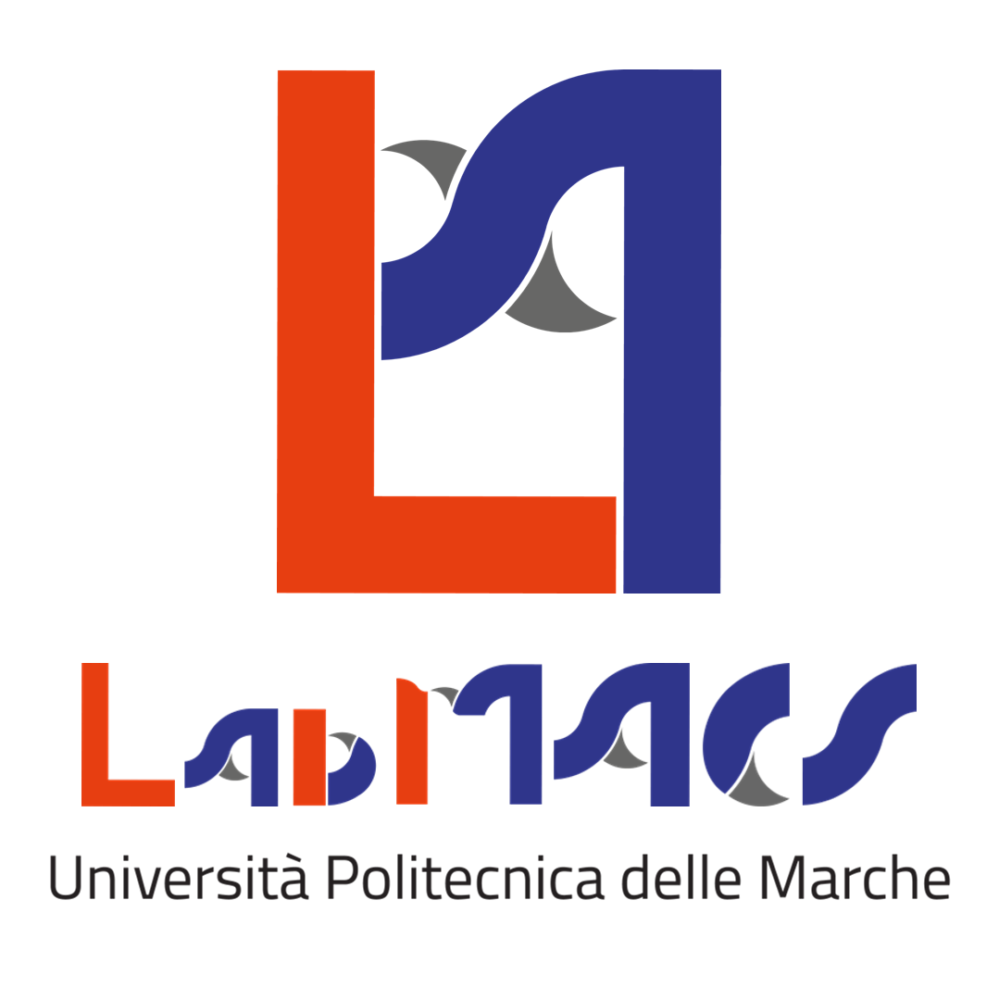

# LabMACS Project Template
<div style="display: flex; flex-wrap: wrap; gap: 10px;">


These are recommended guidelines for the proper creation and management of a GitHub repository.

<p align="center">
    <a href="https://www.labmacs.university/">
 </a>
</p>

> *Disclaimer:*  
> This is only a template. Feel free to modify, adapt, or extend it as needed to best fit the specific requirements of your project.    
> You may also consider adding a logo for the group or project next to the LabMACS logo.

---


| Version | Date       | Description               |
|---------|------------|---------------------------|
| v1.0    | 2025-10-27 | First guidelines version  |

---

## 📑 Table of Contents
1. [Project Overview](#project-overview)
2. [Folder Structure](#folder-structure)
3. [Requirements](#requirements)
    1. [Hardware](#hardware)
    2. [Software](#software)
4. [Pre-Run Configuration](#pre-run-configuration)
    1. [Environment Setup](#setup)
5. [Usage](#usage)
   1. [Run the software](#run)
   2. [Execution Examples](#execution-examples)
6. [Legal](#legal)
    1. [Credits](#credits)
    2. [License](#license)

---

## 🧩 Project Overview <a name="project-overview"></a>
> Provide a short explanation of the project and its purpose.  
> Include **schematics or diagrams** if useful to illustrate the architecture or logic.

---

## 📁 Folder Structure <a name="folder-structure"></a>

The project is organized into the following main directories:

-> **`src`**:  
  Contains the core software.

-> **`documents`**:  
  Includes documentation related to the project, such as manuals, datasheets, the state of the art and reports. Detailed guidelines for managing the GitHub repository and creating manuals and the state of the art can be found here.
  
-> **`media`**:  
  Contains images, schematics, and support files relevant to the project.

-> **`old`**:  
  Contains earlier versions of the software.

---

## 🖥️ Requirements <a name="requirements"></a>
> List all required components **with versions** and **official links** to download them.

### Hardware <a name="hardware"></a>
- Microcontrollers: `e.g., M5CoreS3, ...`
- Sensors/Actuators: `e.g., Witmotion WTGAHRS2, depth sensor, BLDC motor, ...`

### Software <a name="software"></a>
- OS: `e.g. Ubuntu 22.04, Windows 10, ...`
- Languages: ` e.g. Python 3.11`, `C++20`, ...
- Main dependencies and versions: `numpy 1.26.4`, `opencv 4.9.0`, ...
- Toolchain/IDE: `CMake 3.28`, `PlatformIO 6.1.16`, `VS Code 1.105, ...`


---

## ⚙️ Pre-Run Configuration <a name="pre-run-configuration"></a>
> Clear, step-by-step instructions to **install and compile** the software.
> For detailed installation instructions, refer to the **User Manual**.

### Environment Setup <a name="setup"></a>
```bash
# Example (Python)
python -m venv .venv
source .venv/bin/activate
pip install -r requirements.txt
```
---

## ▶️ Usage <a name="usage"></a>

### Run the software <a name="run"></a>
> Clear, step-by-step instructions to **launch** the software.
> The executable should be located in the repository root (not inside any folder)

### Execution Examples <a name="execution-examples"></a>
> Provide some practical use cases and expected output examples

## 👥  Legal <a name="legal"></a>
### Credits <a name="credits"></a>
If you have any suggestions or comments related to this GitHub project, please contact:

*LabMACS, DII, Università Politecnica delle Marche, Via Brecce Bianche, 12, Ancona, 60131, Italy* - [https://www.labmacs.university/](https://www.labmacs.university/)

* **Project Leader**: [David Scaradozzi](mailto:d.scaradozzi@staff.univpm.it)
* **Project Developer**: [Flavia Gioiello](mailto:f.gioiello@pm.univpm.it)

### License <a name="license"></a>
[![CC BY-NC-SA 4.0][cc-by-nc-sa-shield]][cc-by-nc-sa]

This work is licensed under a
[Creative Commons Attribution-NonCommercial-ShareAlike 4.0 International License][cc-by-nc-sa].

[![CC BY-NC-SA 4.0][cc-by-nc-sa-image]][cc-by-nc-sa]

[cc-by-nc-sa]: http://creativecommons.org/licenses/by-nc-sa/4.0/
[cc-by-nc-sa-image]: https://licensebuttons.net/l/by-nc-sa/4.0/88x31.png
[cc-by-nc-sa-shield]: https://img.shields.io/badge/License-CC%20BY--NC--SA%204.0-lightgrey.svg

The “Meccatronica template” is free available.
